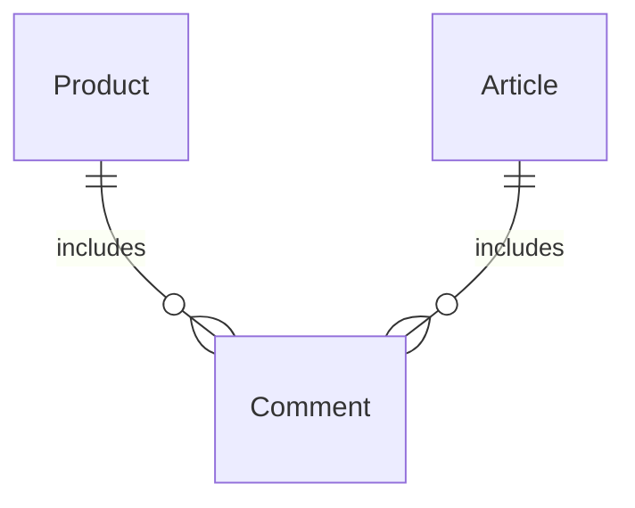

## 중고장터(Product)

1. /prducts
   **GET** 10개 단위로 최신 등록된 상품 기준으로 목록 조회가능

- 제목에 포함된 단어로도 검색 가능
- query 통해서 표시 글 개수, skip 글 개수 지정 가능
- 표시 목록 : id/name/price/createdAt
  **POST** 상품 소개 작성
- 제목 : 1 ~ 100자 이하
- 내용 : 옵션(입력안해도 무방)
- 가격 : 0이상의 숫자
- 태그 : 다수 건 ","로 배열 많아서 등록 가능(옵션)

2. /prducts/detail 작성된 상품 상세 목록 조회(모든 정보)
3. /articles/:id
   **GET** 원하는 아이디 조회
   **PATCH** 수정하고 싶은 게시글의 id를 입력하여 수정
   - 제목 : 1 ~ 100자 이내
   - 내용 : 1 ~ 무제한
     **DELETE** 원하는 아이디 삭제

## 자유게시판(Article)

1. /articles/detail 작성된 게시글 상세 목록 조회(모든 정보)
2. /articles
   **GET** 10개 단위로 최신 등록된 글 기준으로 목록 조회가능

- 제목, 내용에 포함된 단어로도 검색 가능
- query 통해서 표시 글 개수, skip 글 개수 지정 가능
- 표시 목록 : id/title/content/createdAt
  **POST** 게시글 작성
- 제목 : 1 ~ 100자 이하
- 내용 : 1~ 무제한 입력 가능

3. /articles/:id
   **GET** 원하는 아이디 조회
   **PATCH** 수정하고 싶은 게시글의 id를 입력하여 수정
   - 제목 : 1 ~ 100자 이내
   - 내용 : 1 ~ 무제한
     **DELETE** 원하는 아이디 삭제

## 댓글(Comment) : 자유게시판, 중고거래 둘 다 포함

1. /comments/detail

- 모든 댓글 개수 확인 가능(터미널)
- 모든 댓글 목록 상세 정보 조회

2. /comments/products
   **GET** 중고거래 댓글 조회

- cursor 페이지네이션 5개 단위로 가능
  - 조회한 목록 하단 next cursor id 를 query(cursor=000)에 입력하면 이후에 5개 조회
  - 기본 5개 단위(query 통해서 조정 가능)
  - 최신 등록 순으로 조회
- id / content / created 조회

3. /comments/articles
   **GET** 자유게시판 댓글 조회

- cursor 페이지네이션 5개 단위로 가능
  - 조회한 목록 하단 next cursor id 를 query(cursor=000)에 입력하면 이후에 5개 조회
  - 기본 5개 단위(query 통해서 조정 가능)
  - 최신 등록 순으로 조회
- id / content / created 조회

4. /comments/:id 댓글 아이디로 수정/삭제
   **PATCH** 댓글 수정

   - 수정하고 싶은 아이디 조회하여 수정
   - 자유게시판/중고거래 상관 없이 댓글 아이디 사용
     **DELETE** 댓글 삭제
   - 수정하고 싶은 아이디 조회하여 수정
   - 자유게시판/중고거래 상관 없이 댓글 아이디 사용

5. /comments/products/:productID 중고거래 아이디
   **GET** 중고거래에 등록된 댓글만 조회
   **PATCH** 중고거래에 등록된 것만 댓글 생성

6. /comments/articles/:articleID 자유게시판 아이디
  **GET** 자유게시판에 등록된 댓글만 조회
  **PATCH** 자유게시판에 등록된 것만 댓글 생성

# ⚡️ codeit; sprint node.js backend 1기

## Mission (-2025.02.09 Sunday)

### Sprint Mission 1

1. class 설정과 API에 Request를 보내는 함수 생성하기

- 오류 시, 메시지 출력 (try/catch, catch)
- fetch, axios 활용
- 비동기 함수(.then, aync/await)

2. map을 이용하여 API에 있는 값을 생성한 class에 instance로 생성하기

### Sprint Mission 2

1. git 명령어를 통해서 로컬에 있는 내용을 원격에 올리기

- commit을 통해서 작업의 히스토리 기록하기

2. git Hub 레포지토리에 Fork후 PR하기
3. Markdown 활용법을 익히고 README 파일 작성하기
   **GET** 자유게시판에 등록된 댓글만 조회
   **PATCH** 자유게시판에 등록된 것만 댓글 생성