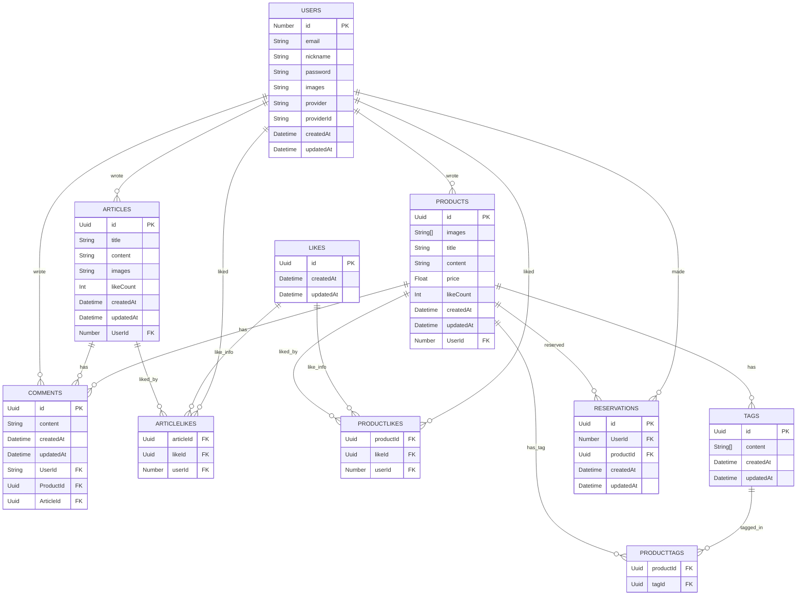

```mermaid
erDiagram
USERS {
Number id PK
String email
String nickname
String password
String images
String provider
String providerId
Datetime createdAt
Datetime updatedAt
}

ARTICLES {
Uuid id PK
String title
String content
String images
Int likeCount
Datetime createdAt
Datetime updatedAt
Number UserId FK
}

PRODUCTS {
Uuid id PK
String[] images
String title
String content
Float price
Int likeCount
Datetime createdAt
Datetime updatedAt
Number UserId FK
}

COMMENTS {
Uuid id PK
String content
Datetime createdAt
Datetime updatedAt
String UserId FK
Uuid ProductId FK
Uuid ArticleId FK
}

LIKES {
Uuid id PK
Datetime createdAt
Datetime updatedAt
}

ARTICLELIKES {
Uuid articleId FK
Uuid likeId FK
Number userId FK
}

PRODUCTLIKES {
  Uuid productId FK
  Uuid likeId FK
  Number userId FK
}

TAGS {
Uuid id PK
String[] content
Datetime createdAt
Datetime updatedAt
}

PRODUCTTAGS {
Uuid productId FK
Uuid tagId FK
}

RESERVATIONS {
Uuid id PK
Number UserId FK
Uuid productId FK
Datetime createdAt
Datetime updatedAt
}

USERS ||--o{ ARTICLES : wrote
USERS ||--o{ PRODUCTS : wrote
USERS ||--o{ COMMENTS : wrote
ARTICLES ||--o{ COMMENTS : has
ARTICLES ||--o{ ARTICLELIKES : liked_by
LIKES ||--o{ ARTICLELIKES : like_info
USERS ||--o{ ARTICLELIKES : liked
PRODUCTS ||--o{ COMMENTS : has
PRODUCTS ||--o{ PRODUCTLIKES : liked_by
LIKES ||--o{ PRODUCTLIKES : like_info
USERS ||--o{ PRODUCTLIKES : liked
PRODUCTS ||--o{ TAGS : has
PRODUCTS ||--o{ PRODUCTTAGS: has_tag
TAGS ||--o{ PRODUCTTAGS: tagged_in
PRODUCTS ||--o{ RESERVATIONS: reserved
USERS ||--o{ RESERVATIONS : made
```
